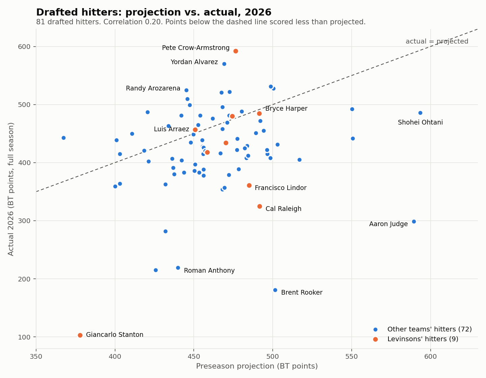
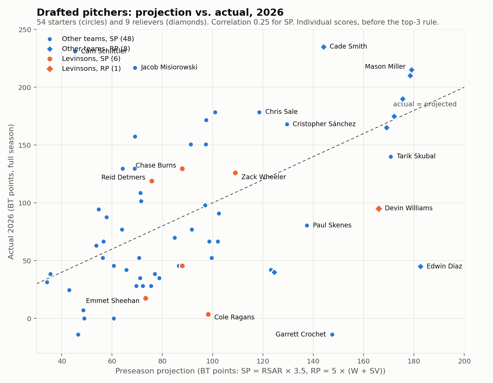

# BT Baseball Pool 2026 — Draft Retrospective

What the preseason model said on draft day (2026-03-30) versus what actually happened. Sources: `data/projections_cache.json` (PitcherList projections run through the BT scoring formula, the board the draft tool recommended from), the league draft tracker (overall pick numbers for rounds 1–12), final 2026 MLB Stats API season and game-log data, and the commissioner's official `RESULTS .xlsm`. Actual points below use the official final MLERA of 4.17.

## The short version

- **The draft did not win this. In-season management did.** The 16 players Jon drafted, scored on their actual full 2026 seasons with no swaps, total 4,124 points. That is last place, 130 behind Palma. Five substitutions added 552 points and turned it into a 2nd-place 4,676.
- **The model projected Levinsons 6th of 9 (4,637). Actual was 2nd (4,676).** The total was almost exactly on projection. The rank moved because Winters, Palma and Washington fell far short of their projections.
- **The model was accurate on the middle of the roster and wrong at the top.** Merrill, Arraez and Harper each landed within 6 points of projection. The first two picks, Raleigh and Lindor, missed by 167 and 124, both on injuries.
- **Pete Crow-Armstrong at pick 28 was the best pick in the league.** 592 points, the top hitter score of any team, 116 above projection.
- **The four hitter swaps and the RP swap were right in four of five cases.** The catcher chain after Raleigh's oblique injury cost 29 points; the other four gained 83, 345, 82 and 70.

## 1. Did the model predict the standings?

| Team | Model projection | Model rank | Official | Actual rank | Miss |
|------|-----------------:|:----------:|---------:|:-----------:|-----:|
| Cobey | 4,728 | 2 | 4,788 | 1 | +60 |
| **Levinsons** | **4,637** | **6** | **4,676** | **2** | **+39** |
| Lerner | 4,715 | 3 | 4,664 | 3 | -51 |
| Winters | 4,817 | 1 | 4,649 | 4 | -168 |
| Mudge | 4,683 | 4 | 4,636 | 5 | -47 |
| Williams | 4,484 | 8 | 4,558 | 6 | +74 |
| Tchir | 4,429 | 9 | 4,554 | 7 | +125 |
| Washington | 4,499 | 7 | 4,379 | 8 | -120 |
| Palma | 4,681 | 5 | 4,254 | 9 | -427 |

Correlation between projected and actual team totals: 0.36. The model called Cobey, Lerner, Mudge and Washington within one place each. It had Winters winning (Judge went 1st overall and scored 299) and Palma mid-pack (Rooker, pick 23, scored 181, the biggest bust in the league). Six of nine teams finished below projection; the model over-projected hitters league-wide by about 42 points per player, almost entirely lost playing time.

**Draft versus management, league-wide.** Scoring each team's original 16 on full-season actuals with no swaps:

| Team | Drafted-16, no swaps | Official | Value of in-season moves |
|------|---------------------:|---------:|-------------------------:|
| Tchir | 4,728 | 4,554 | -174 |
| Lerner | 4,572 | 4,664 | +92 |
| Cobey | 4,462 | 4,788 | +326 |
| Winters | 4,454 | 4,649 | +195 |
| Mudge | 4,388 | 4,636 | +248 |
| Washington | 4,129 | 4,379 | +250 |
| **Levinsons** | **4,124** | **4,676** | **+552** |
| Williams | 4,088 | 4,558 | +470 |
| Palma | 3,910 | 4,254 | +344 |

Tchir drafted the best roster in the league and managed it down to 7th. Jon drafted the 7th-best roster and managed it up to 2nd. Cobey won by doing both reasonably well plus two rookie-pitcher hits (Misiorowski, King).

## 2. Levinsons, pick by pick

Actual = the drafted player's full 2026 season under BT scoring, regardless of when he was swapped out.

| Pick | Slot | Player | Projected | Actual | Diff | Verdict |
|-----:|------|--------|----------:|-------:|-----:|---------|
| 9 | C | Cal Raleigh | 492 | 325 | -167 | Bust. .182, oblique IL in May. Model had him 15th hitter overall; taken 9th. |
| 10 | SS | Francisco Lindor | 485 | 361 | -124 | Bust. Calf strain 4/23, 418 AB, .225. Model had him 18th; taken 10th. |
| 27 | 3B | Bo Bichette | 470 | 434 | -36 | Slightly short. Healthy, 638 AB, but 18 HR / .260. |
| 28 | OF | Pete Crow-Armstrong | 476 | 592 | +116 | Best pick in the league. 45 HR, 119 R, 41 SB. |
| 45 | OF | Jackson Merrill | 474 | 480 | +6 | On the number. |
| 46 | 2B | Luis Arraez | 451 | 457 | +6 | On the number. .310 did what it was drafted to do. |
| 63 | 1B | Bryce Harper | 491 | 485 | -6 | On the number. |
| 64 | SP | Zack Wheeler | 109 | 126 | +17 | Right, despite starting the year on the IL. 3.00 ERA, 162 IP. |
| 81 | OF | Teoscar Hernández | 459 | 418 | -41 | Short. Hamstring IL from 5/27. |
| 82 | SP | Chase Burns | 88 | 130 | +42 | Right. 2.86 ERA, 154 IP. Top RSAR on the team. |
| 99 | SP | Emmet Sheehan | 73 | 18 | -56 | Bust. 4.57 ERA. |
| 100 | RP | Devin Williams | 166 | 95 | -71 | Bust. Lost the Mets closer job. |
| R13 | SP | Cole Ragans | 98 | 4 | -95 | Bust. 35 IP, injured. Model had him 13th SP. |
| R14 | SP | Nathan Eovaldi | 88 | 46 | -42 | Short. 4.20 ERA is exactly league average, so near-zero RSAR. |
| R15 | SP | Reid Detmers | 76 | 119 | +43 | Right. 185 IP, 3.36 ERA, third counting starter. |
| R16 | DH | Giancarlo Stanton | 378 | 103 | -275 | Bust. 24 games all year. |

Six of nine drafted hitters and three of six starters finished within 45 points of projection. The misses are concentrated in injuries (Raleigh, Lindor, Hernández, Ragans, Stanton) rather than in wrong reads of healthy players.

**What the model would have taken instead.** At picks 9 and 10 the model's best available were Julio Rodríguez (431 actual), Brent Rooker (181), Pete Alonso (528) and Fernando Tatis Jr. (531). Two of those four would have been worse than or equal to the Raleigh and Lindor busts. The board's rank order at the top carried no real edge. The one clear hindsight regret is that Crow-Armstrong and Yordan Alvarez (570) were both still available at 9 and 10; the model had them 27th and 35th.

## 3. Where the points came from

| Category | Projected (drafted 16) | Official final | Diff |
|----------|-----------------------:|---------------:|-----:|
| Hitters (9 slots) | 4,176 | 4,136 | -40 |
| SP (best 3 × 3.5) | 295 | 375 | +80 |
| RP | 166 | 165 | -1 |
| **Total** | **4,637** | **4,676** | **+39** |

- **Hitting** landed 40 short of projection even though three drafted hitters collapsed, because the swaps replaced most of the lost production and Crow-Armstrong covered the rest.
- **Starting pitching** beat projection by 80 because the top-3 rule only counts the hits. Burns, Wheeler and Detmers delivered 37, 36 and 34 RSAR; Ragans, Sheehan and Eovaldi cost nothing beyond their draft slots. Drafting six starters where three were expected to matter was the right structure.
- **Relief** ended on projection only because of the Hader swap. Williams alone was on pace for 95.

## 4. Swap scorecard

Rest-of-season is measured from each swap's effective date. "Slot impact" is the change in that slot's final points versus keeping the original player all year.

| Date | Slot | Out | In | Reason at the time | ROS out | ROS in | Slot impact |
|------|------|-----|----|--------------------|---------|--------|------------:|
| 4/27 | SS | Lindor | McGonigle | Calf strain, 5–8 weeks | 325 AB, .225, 113 counting | 499 AB, .267, 161 counting | **+83** |
| 5/04 | DH | Stanton | Ben Rice | Injured | 0 AB (never returned) | 465 AB, 29 HR, 175 counting | **+345** |
| 5/18 | C | Raleigh | Jeffers → Basallo → Dingler | Oblique, 10-day IL; then Jeffers hamate (6/01), Basallo shoulder (8/02) | 290 AB, .193, 100 counting | 293 AB, .188, 79 counting | **-29** (detail below) |
| 6/15 | OF | Hernández | Chourio | Hamstring IL since 5/27 | 261 AB, .261, 81 counting | 370 AB, .278, 152 counting | **+82** |
| 7/15 | RP | D. Williams | Hader | One-swap window; lost closer role | 3 SV | 16 SV + 1 W | **+70** |
| 6/21 | 3B | Bichette | M. Vargas | *Reverted: Bichette not on IL, swap not permitted* | 331 AB, .269, 84 counting | 318 AB, .261, 133 counting | (would have been about +45) |

- The Stanton and Hernández moves were the season. The DH swap alone is worth more than the gap to Cobey.
- The Hader analysis predicted +40 to +50 and delivered +70.
- The catcher chain is the one negative. Each link was forced by an injury to the previous catcher, and the catcher free-agent pool was thin all year, but holding Raleigh through his oblique stint would have scored 325 instead of 296. Reads at the time were reasonable; the outcome was not.

**Catcher slot, segment by segment.** The first segment is common to both scenarios, so the whole gap is from 5/18 on.

| Segment | Dates | AB | H | HR | RBI | R | SB |
|---------|-------|---:|--:|---:|----:|--:|---:|
| Raleigh | Opening Day to 5/17 | 161 | 26 | 7 | 18 | 16 | 2 |
| Jeffers | 5/18 to 5/31 | 3 | 1 | 0 | 0 | 1 | 0 |
| Basallo | 6/01 to 8/01 | 123 | 23 | 7 | 21 | 11 | 0 |
| Dingler | 8/02 to end | 167 | 31 | 4 | 19 | 16 | 0 |
| **Actual slot** | | **454** | **81** | **18** | **58** | **44** | **2** |
| **Raleigh, full season** | | **451** | **82** | **23** | **69** | **49** | **2** |

Actual slot: .178 → 178 + 18 + 58 + 44 + 2 = 300 (official sheet: 296). Raleigh all year: .182 → 182 + 23 + 69 + 49 + 2 = 325. Same at-bats and hits after 5/18; Raleigh produced 21 more counting stats than the three replacements combined and returned faster than the May read expected (85 games after 5/18).
- The reverted Vargas move would have gained about 45. It was correctly reverted on rules grounds, not on merit.

## 5. Model calibration across all 144 drafted players

| Type | n | Mean projected | Mean actual | Bias | Correlation | Mean abs. error |
|------|--:|---------------:|------------:|-----:|------------:|----------------:|
| Hitters | 81 | 464 | 422 | -42 | 0.20 | 66 |
| SP | 54 | 80 | 77 | -3 | 0.25 | 47 |
| RP | 9 | 166 | 152 | -13 | 0.28 | 53 |

Within the drafted pool, projection order barely predicted outcome order. That is partly range restriction (everyone drafted was projected 400 to 590) and partly that the biggest swings were injuries the model cannot see. The hitter bias of 42 points is the cost of projecting full playing time for everyone.

Biggest busts league-wide: Rooker -320, Judge -290, Stanton -275, Roman Anthony -221, Luis Robert -211, Raleigh -167, Crochet -161. Biggest breakouts: Schlittler +186, Misiorowski +148, Crow-Armstrong +116, Yordan Alvarez +101, Cade Smith +91, Rasmussen +89, Arozarena +80. Two of the top three SP seasons in the league came from pitchers drafted in rounds 13 to 16 with projections under 70.

## 6. What we got right

- **Roster construction.** Six starters with the expectation that three would carry the slot worked. SP beat projection by 80 despite three busts.
- **Mid-tier hitter reads.** Merrill, Arraez and Harper within 6 points each. Bichette and Hernández within 45.
- **Crow-Armstrong at 28.** Projected 27th among hitters, finished 1st.
- **Every injury replacement except the catcher chain.** Four moves, +580 combined, each backed by a written analysis that predicted the direction correctly.
- **The one-swap window.** Choosing Hader over the best hitter and SP upgrades (about +17 each) was the right use of the only unrestricted move.

## 7. What we got wrong

- **Spending picks 9 and 10 on Raleigh and Lindor.** Both were reaches versus the model's board (15th and 18th) and both lost most of the year. The model did not flag them, but it also had no better answer at the top; the lesson is about the ceiling of any projection at the top of the draft rather than about these two names.
- **Stanton at DH.** The model projected 362 AB for a player who had not reached 400 AB in years. A 16th-round pick, so cheap, but it set up an early forced swap.
- **Pitcher depth picks.** Ragans, Sheehan and Eovaldi were all taken on projections of 73 to 98 and produced 4, 18 and 46. The model's SP correlation of 0.25 says these picks were close to coin flips.
- **The catcher chain.** Three catcher swaps produced a .176 slot. Whether to hold an injured star or churn low-ceiling replacements was never modelled explicitly; it should be for 2027.
- **Site accuracy on swapped slots.** Not a draft error, but the site under-reported swapped slots by 34 points by season's end because those slots did not self-heal. Fixed in the wrap-up; the pipeline fix is in `season-2026-final.md`.

## 8. For 2027

1. **Model playing time explicitly.** Cap projected AB and IP by age and prior-three-year availability. The 42-point hitter bias and the Stanton, Rooker and Judge busts are all playing-time misses.
2. **Discount the top of the board.** Above pick 20 the model's ordering had no edge; prefer the healthiest profile among the top tier over the highest number.
3. **Keep six starters, but weight IP over ERA in rounds 13 to 16.** Detmers (185 IP, 3.36) outscored Ragans and Sheehan combined by 97. Innings are the multiplier in RSAR.
4. **Build an injured-star hold-versus-replace calculator.** Inputs: expected return date, replacement's ROS projection, and the 300 AB floor. The catcher chain would have been caught.
5. **Treat the swap windows as the main event.** Half the league gained 200 to 550 points on substitutions. Keep the 30-day-usage ROS method from the 7/13 analysis as the standard.
